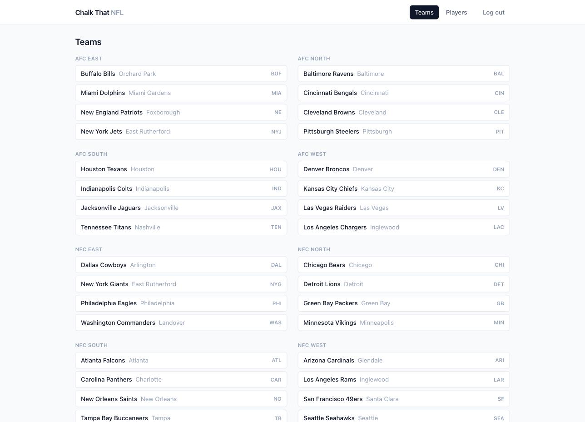
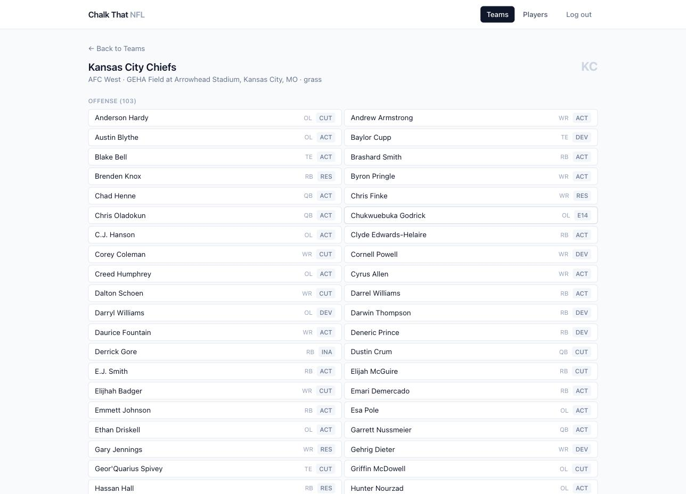
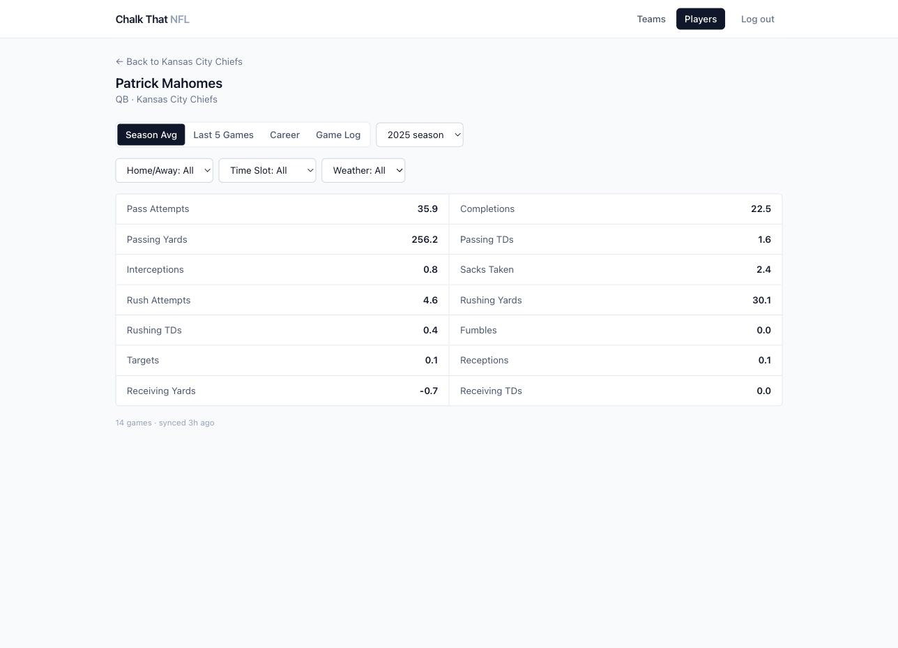
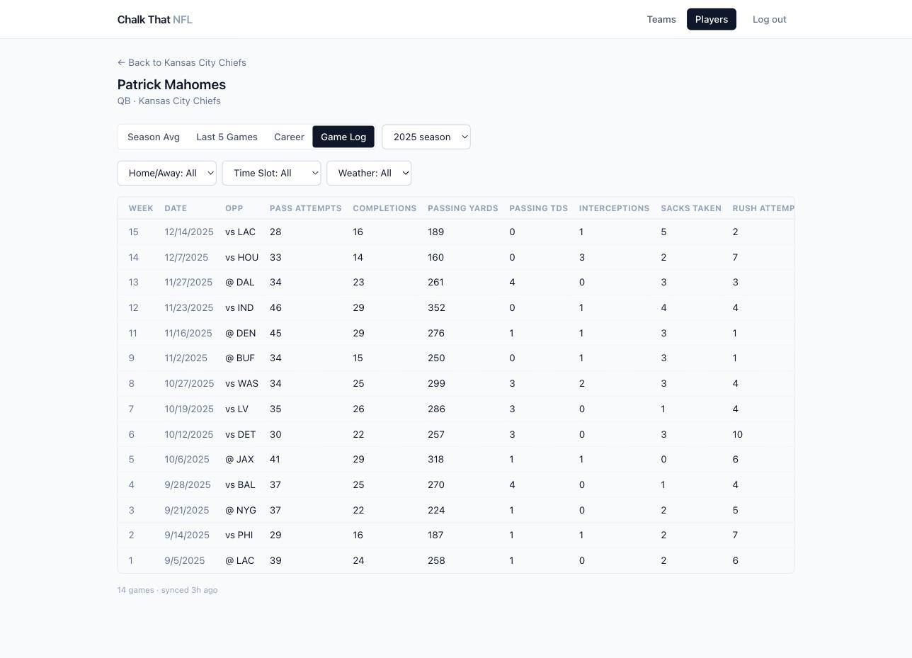

# Chalk That NFL

A stats research app for NFL teams and players — built as the first app in a
personal "Chalk That" platform (a sibling to an existing Chalk That MLB app).
It pulls real historical and current-season data from
[nflverse](https://github.com/nflverse) into Postgres, then exposes it
through one shared query API that a browser UI (and, eventually, a team of
AI research agents) both call the same way: give it an entity, a scope, and
some splits, and get back real numbers with no predictions baked in — home/
away splits, weather-condition splits, time-slot splits, season averages,
last-5, career, or a full game log. The bigger idea driving the design: this
becomes the data layer a fleet of AI agents can query directly to do the
research and number-crunching behind sports betting picks, instead of
someone doing that by hand. See `docs/architecture.md` for the full design
writeup, including that "Part 2" vision.

**Live app:** https://web-production-5f05d.up.railway.app
**API:** https://backend-api-production-15ce.up.railway.app

---

## Screenshots

| Teams | Team roster |
|---|---|
|  |  |

| Player — season averages | Player — game log |
|---|---|
|  |  |

---

## Tech stack

| Piece | Choice | Why |
|---|---|---|
| Backend | Node + Express | Small, unopinionated, matches the sibling MLB app's stack — one less thing to context-switch between. |
| Database | Postgres (Railway-managed) | Real relational integrity for `players` ↔ `games` ↔ `*_game_stats` joins, and a proven fit for structured sports stats. |
| Cache | Redis (Railway-managed) | Cheap repeat-query caching for the query engine — cheaper than the alternative of pre-computing/storing derived stats, which the design deliberately avoids (see "no predictive calculations" in `docs/architecture.md` §2). |
| Frontend | React (JS, not TS) + Vite + Tailwind v4 + React Router v7 | Matches the plain-JS backend rather than mixing languages; Vite + Tailwind v4's `@tailwindcss/vite` plugin needs no separate PostCSS config. |
| Auth | JWT access token + rotating refresh token (humans), long-lived API key (agents/services) | Two credential types sharing one `authenticate` middleware — see `docs/architecture.md` §2/§4.5. Refresh-token replay triggers a full session revoke, not just a rejected request. |
| Ingestion | A separate Node worker (`worker/`), its own Railway service, no public domain | Keeps the trusted internal writer (direct DB access) fully separate from the public, auth-gated API — see `docs/architecture.md` §4. |
| Data source | [nflverse](https://github.com/nflverse) (free, open, CC-BY-4.0) | Historical stats, rosters, schedules, and weather are all in one place; current-season/live stats and sportsbook odds are intentionally deferred (see Known limitations below). |
| Deploy | Railway (3 services + managed Postgres/Redis, one project) | One project holds `backend-api`, `web`, and `ingestion-worker`, all sharing the same Postgres/Redis instances. |

---

## How to run locally

You'll need Node 18+, a Postgres database (a local one, or the Railway
Postgres instance's public/proxy connection string), and Redis is optional
for local dev (only the deployed query-caching path needs it).

```bash
git clone <this repo>
cd ai-application-nfl

# 1. Backend + worker (shared root package.json)
npm install
cp .env.example .env        # fill in DATABASE_URL, JWT_SECRET, etc.
psql "$DATABASE_URL" -f db/schema.sql
psql "$DATABASE_URL" -f db/migrations/002_username_auth.sql

# 2. Seed data — teams, stadiums, current-season roster
npm run seed

# 3. (Optional but recommended) Backfill 5 seasons of real historical
#    games + box-score stats, so /query returns real numbers instead of
#    empty results — this is what makes the Player pages interesting
npm run backfill-historical -- 2021 2025

# 4. Create a login user for the frontend
npm run create-test-user -- <username> <password>

# 5. Start the API
npm start                   # backend-api on :3000 (see PORT in .env)

# 6. Frontend, in a second terminal
cd frontend
npm install
cp .env.example .env        # VITE_API_URL defaults to localhost:3000
npm run dev                 # Vite dev server on :5173
```

The ingestion worker (`npm run worker -- <jobType>` for a one-shot dry run,
or `npm run worker` for the real scheduler) is optional for local dev — the
historical backfill script covers everything needed to explore the app.
Job types: `sync_roster`, `sync_schedule`, `sync_historical_stats` are real;
`sync_forecast_weather`, `sync_injury_reports`, `sync_live_stats` are wired
for scheduling but still stubbed (see Known limitations).

---

## Known limitations / future work

- **Three of six ingestion jobs are still stubs.** `sync_forecast_weather`,
  `sync_injury_reports`, and `sync_live_stats` have real scheduling logic
  but no vendor integration yet — current-season/live stats and injury
  reports depend on a still-open vendor decision (BallDontLie vs.
  Highlightly), and forecast weather needs an Open-Meteo API key
  provisioned. Historical stats, rosters, and schedules are fully real.
- **No automated test suite.** Everything was verified through manual
  dry-runs and live browser stress-testing (see Phase 6 in
  `docs/vibe-coding-checklist.md`) rather than unit/integration tests —
  fine for a personal project at this stage, a real gap if this ever needs
  other contributors.
- **No rate limiting on `/login` or `/refresh`.** Reviewed during the
  hardening pass and deliberately deferred — worth adding before any
  real/public exposure.
- **Refresh tokens live in `localStorage`**, not an httpOnly cookie —
  reviewed and deliberately left alone for now; would reduce XSS exposure
  but is a larger client-side rework than this pass's scope.
- **No signup flow.** Accounts are created directly via
  `scripts/create-test-user.js` — fine for personal/friends use, not built
  for self-serve.
- **Natural-language search and the AI agent layer are designed, not yet
  built.** `docs/architecture.md` §1 and §5 sketch both — a "Part 2" agent
  service that would call the same `/query` API a human click does, plus a
  natural-language translation layer in front of it. This is the actual
  long-term point of building Part 1 the way it's built.
- **No iOS app yet** — planned as a fast-follow on the same API, not
  started.
- **Sportsbook odds/props** are deferred past this stage entirely.

For the full build history, every real bug hit along the way, and the
day-by-day decisions behind all of the above, see `docs/architecture.md`
(design decisions) and `docs/vibe-coding-checklist.md` (phase-by-phase build
log).
