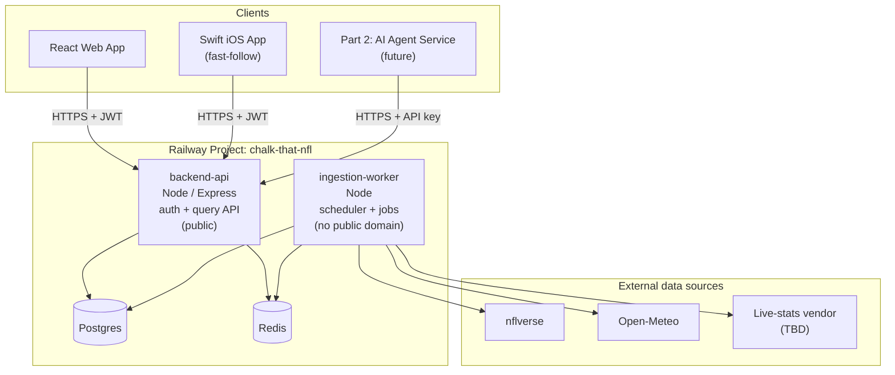

# Chalk That — Platform Architecture

This document captures the System Design decisions made for **Chalk That NFL**, the first app in the Chalk That platform. It's split so future sport-apps (NBA, MLB, a revived WNBA) can reuse the parts that are genuinely platform-level, while knowing which parts are NFL-specific choices to be re-decided per sport.

---

## 1. Platform vision

Every Chalk That app is two parts. **Part 1** is a stats research app — raw team/player data, trends, career stats, and situational splits, pulled live from source APIs, with no predictive calculations. **Part 2** is a separate future AI agent service that layers projections, simulations, and confidence scores on top of Part 1's data.

The reason Part 1 exists as its own product, not just a data layer baked into Part 2: it's meant to be hit directly by Part 2's agents the same way a human hits it through the web/iOS app, so agents never depend on a third-party research tool's rate limits or terms of service. One query engine, multiple clients — human UI today, AI agents later, any future sport-app always.

---

## 2. Platform-level patterns (reusable across every sport-app)

These are the architectural decisions that should carry into NBA/MLB/WNAB versions largely unchanged, independent of which sport or which data vendors are involved.

**One shared query engine, multiple clients.** The backend exposes a single structured query API (entity, stat, scope, splits → structured response with sample size and freshness metadata). The web app's filter UI, a future natural-language search layer, and Part 2's AI agents are all just different callers of the same endpoint — never separate parallel APIs.

**No predictive calculations in Part 1.** Splits and aggregates (season averages, home/away records, situational filters) are simple filtered counts/averages computed at query time, not stored derived tables and never a forecast. Redis caching is what makes repeating those queries cheap, not pre-computation.

**Independent canonical identity + crosswalk table.** Every entity that might be sourced from more than one vendor (players, first and foremost) gets an id we mint ourselves — never anchored to any single vendor's id scheme. A single `entity_id_crosswalk`-style table (not a new table or new column per source) maps every vendor's native id to that canonical id, with a `manual_review` state for ambiguous/unresolved matches. This is the same pattern the real-world Chadwick Bureau Register uses for baseball players across MLBAM/Retrosheet/Baseball-Reference/FanGraphs — proven at scale, and it means adding or swapping a data vendor is a data change, never a schema migration.

**Ingestion is a separate service, never bolted onto the main API.** A dedicated worker owns pulling from external sources and writing to Postgres/Redis directly — it does not go through the main backend's API or its auth layer, since it's a trusted internal writer, not an external reader. This mirrors how Part 2's AI agent service is also kept separate from the main backend.

**Two-tier auth.** Human users get a real login session — short-lived JWT access token, revocable refresh token, standard web/mobile session pattern. Agents (and other trusted services) get a single long-lived API key with no session at all, checked by the same middleware but routed differently. Same API surface either way — the credential type changes who's asking, not what they can ask for.

**Situational data is tagged at ingestion, not computed at query time.** Anything used as a query filter often enough to matter (time-slot classification, weather condition, home/away) gets resolved into a plain column when data is written, so filtering on it is a `WHERE` clause, not a runtime computation or join.

---

## 3. NFL-specific decisions (this app)

The choices below are Chalk That NFL's answers to the platform patterns above — a future sport-app will make its own version of each.

**Data sources.** Historical stats, career data, injury reports, and historical weather (already embedded in play-by-play): [nflverse](https://github.com/nflverse) — free, open, CC-BY-4.0. Forecast weather for upcoming games: Open-Meteo — free while building, ~$29/mo commercial tier once live. Current-season/live stats: still undecided, parked between BallDontLie and Highlightly. Sportsbook odds/props: deferred to a post-MVP phase entirely.

**Schema** (`db/schema.sql`): `stadiums`, `teams`, `players` (UUID canonical id), `player_id_crosswalk`, `games` (with precomputed `game_slot` and `weather_condition`), `team_game_stats`, `player_offense_game_stats` / `player_defense_game_stats` / `player_special_teams_game_stats` (split by position group rather than one wide table), `injury_reports` (append-only time series), `ingestion_runs` (freshness/audit log), and the auth tables `users` / `refresh_tokens` / `api_keys`.

**Situational splits scoped for MVP:** home/away, Sunday early (1pm ET) / late (4pm ET) / primetime, Monday Night, Thursday Night, Thanksgiving, and weather (sunny/overcast/rain/snow/dome — dome games get their own explicit tag rather than being force-fit into a weather condition).

**MVP scope:** full roster depth (offense/defense/special teams/kicking), React web first with Swift iOS as a fast-follow on the same API, no sportsbook props at launch, graceful (not just non-broken) handling of offseason/preseason/bye-week/rookie empty states.

---

## 4. Deployment topology (Railway)

One Railway project holds every service plus the managed Postgres and Redis plugins, which `backend-api` and `ingestion-worker` both connect to as the same shared instances.

**`backend-api`** — the only public-facing service. Owns auth (`backend/auth.js`) and the query API. Every client (web, iOS, agents) talks to this and only this.

**`ingestion-worker`** — no public domain at all; it only makes outbound calls (to nflverse/Open-Meteo/the live-stats vendor) and reaches Postgres/Redis over Railway's private network. It writes directly to the database rather than through `backend-api`'s HTTP layer or auth — it's a trusted internal writer, not an external reader, so routing it through auth would be pure overhead and unnecessary exposed surface.

**Postgres / Redis** — Railway-managed plugins, shared by both services. Railway auto-injects `DATABASE_URL` / `REDIS_URL` into any service linked to them, so no manual connection-string management.

**React web** — its own Railway service (built static app or a small Node server serving the build), calling `backend-api`'s public URL.

**Swift iOS** — not a Railway service at all; a client distributed through the App Store, hitting the same public `backend-api` URL once it exists.

**Part 2 (future)** — slots in architecturally identical to `ingestion-worker`: its own service, connected to the same Postgres/Redis, but it authenticates to `backend-api` as a normal API-key client rather than writing directly — same as any other agent.

### Env vars / secrets by service

| Service | Needs |
|---|---|
| `backend-api` | `DATABASE_URL`, `REDIS_URL`, `JWT_SECRET` |
| `ingestion-worker` | `DATABASE_URL`, `REDIS_URL`, `OPEN_METEO_API_KEY`, `LIVE_STATS_VENDOR_API_KEY` (once chosen) |
| React web | `BACKEND_API_URL` (build-time) |

`JWT_SECRET` only ever needs to exist on `backend-api` — it's the only service verifying tokens; `ingestion-worker` never authenticates incoming requests, so it never needs it.

---

## 5. Natural-language query layer (fast-follow, not MVP)

The StatMuse-style search bar — designed conceptually now, not yet scaffolded in code, since structured filters ship in MVP and this layers on after.

**The LLM only ever translates — it never touches actual data.** A question goes to an LLM with the structured query schema from §4/the query API as its target shape; its only job is extracting intent into that shape ("how did Mahomes do in primetime games this season" → `{ entity_type: "player", entity_name_raw: "Mahomes", splits: { game_slot: "primetime" }, scope: "season" }`). The LLM never sees or generates a stat value — the resulting structured object is handed to the exact same query API a filter click would call, so the numbers always come straight from Postgres. This keeps the same "translation, not computation" boundary that governs the rest of Part 1.

**Entity resolution reuses the crosswalk's matching logic.** The LLM extracts a raw name; resolving it to a real `player_id` is a separate, deterministic fuzzy name-lookup against `players` (last-name search, same idea as pybaseball's `playerid_lookup`). An ambiguous or unresolved match should prompt a clarifying question back to the user rather than guess — the same philosophy as the `manual_review` state in `player_id_crosswalk`, just surfaced conversationally instead of sitting in an admin queue. This fuzzy-matching logic is worth building once as a shared function, since both the ingestion worker's identity resolution and this layer's entity resolution need the same capability.

**Where it lives:** not a separate service — one more endpoint on `backend-api` (e.g. `POST /query/nl`) doing extract → resolve → call the existing structured endpoint internally, then either returns the raw structured result (for an agent) or phrases it into a sentence (for a human). That phrasing step is templated text (cheap, no extra LLM cost) vs. a second LLM call (more natural, costs more) — an open sub-decision, not urgent given this is already fast-follow.

**Cost/latency note:** every NL query costs an LLM API call that a plain filter click doesn't — a real new cost and external dependency (LLM provider uptime/latency) on top of everything else. Reinforces why structured filters belong in MVP and NL search comes after, not just a nice-to-have ordering.

## 6. Still open

Current-season/live-stats vendor (BallDontLie vs. Highlightly) — parked, not blocking anything designed so far. Sportsbook odds/props integration — deferred past MVP entirely. The NL query layer above is designed but not yet scaffolded in code.
